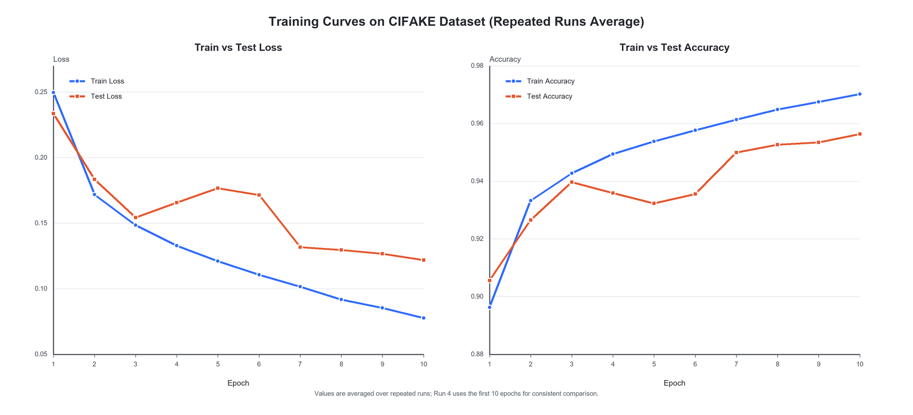

# AI Image Detector

这个项目用于判断一张图片更像是真实图像还是 AI 生成图像。

## 项目目标

输入一张 RGB 图片，输出：

- `prediction`: `real` 或 `fake`
- `AI degree`: 模型认为这张图像是 AI 生成图像的概率

## 项目结构

```text
AI_Image_Detector/
  data/
    train/
      real/
      fake/
    test/
      real/
      fake/
  model.py
  dataset.py
  train.py
  predict.py
  app.py
  detector.pth
  train_test_loss_acc_curve_repeated_runs.png
  paper_draft.md
```

## 环境

本项目基于 Python + PyTorch。

主要依赖：

- `torch`
- `torchvision`
- `PIL`
- `tkinter`

## 数据集格式

`dataset.py` 使用 `ImageFolder` 读取数据，所以图片必须放在文件夹中，不能直接平铺。

推荐结构：

```text
data/
  train/
    real/
    fake/
  test/
    real/
    fake/
```

注意：

- 文件夹名会自动变成类别标签
- `fake` 通常会被编码成 `0`
- `real` 通常会被编码成 `1`

## 训练

运行：

```powershell
python train.py
```

训练过程会：

1. 读取 `data/train` 和 `data/test`
2. 训练卷积神经网络
3. 输出每轮的 loss 和 accuracy
4. 保存最优模型到 `detector.pth`

## 训练曲线

下图展示了多次重复实验后，每个 epoch 的平均 train/test loss 和 accuracy 变化。



## 预测单张图片

运行：

```powershell
python predict.py "你的图片路径.jpg"
```

输出示例：

```text
AI degree: 93.21%
real degree: 6.79%
prediction: fake
```

## 本地前端

运行：

```powershell
python app.py
```

前端功能：

- 选择图片
- 显示预览
- 显示预测结果
- 显示 AI degree

## 结果说明

当前模型是在 CIFAKE 数据集上训练的，所以它更适合判断：

```text
“和 CIFAKE 分布相近的图片”
```

它不一定能可靠处理所有现实世界照片。  
如果一张普通真实照片被判成高 AI degree，这通常说明模型存在分布外泛化问题，而不是代码出错。

## 论文与报告

`paper_draft.md` 是课程报告底稿，可以继续改写成最终提交版本。

## 备注

- `detector.pth` 是训练好的模型参数文件
- `__pycache__` 是 Python 自动生成的缓存目录，可以忽略
- 如果你要重新训练，可以直接覆盖 `detector.pth`
